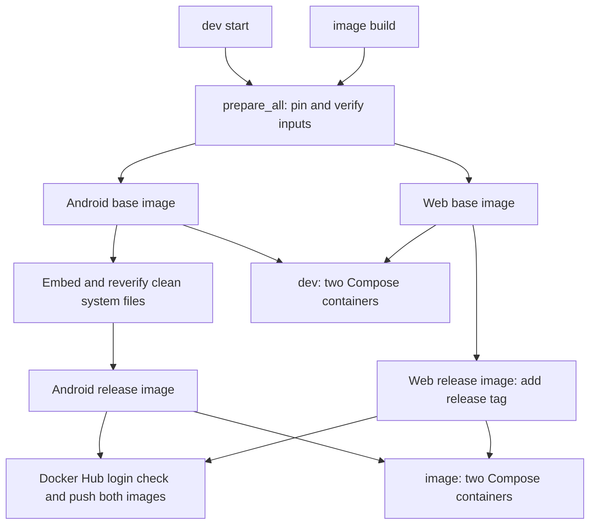
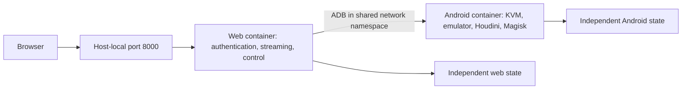

# Implementation Overview

[简体中文](OVERVIEW.md) | **English** | [Usage guide](README.en.md)

Both `image` and `dev` run separate Android and web containers. Image acquisition and storage differ; there is no combined-service build or single-container startup path.

## Build pipeline

`prepare_all` checks tools/KVM, verifies system files and four SDK ZIPs, generates Dockerfiles/Compose/patches, builds two base images and records sources and installed package versions.

`dev start` then runs development Compose. `image build` uses `Dockerfile.release` to add clean system.img, ramdisk.img and the Magisk APK to the Android base, and tags the web base for publication. It then calls `push_release_images`: Docker reuses valid credentials or prompts for login, and pushes both tags in order. Building neither starts a phone nor copies user state. Login or push failure returns an error; previously successful pushes are not rolled back.

The Android release Dockerfile starts only from the Android base. It does not copy web programs or install a combined supervisor. It inherits the same Android entrypoint used in development. The web release and development web image are the same artifact.

## Runtime topology

`write_compose` generates both modes. Emulator parameters, environment, health checks, shared networking, restart policies and startup dependencies are identical. Web uses `network_mode: service:android7` and waits for Android's health check.

Development adds build sections and read-only `patched/` mounts, and uses project directories for state. Image deployment has no build sections, embeds system files and uses two named volumes. Only host-local port 8000 is published; no separate ADB port is exposed.

## Image command flow

`image pull/start → cmd_image_start`:

1. Select the explicit pair or read saved `.android7-image.env` references; use the default tags on first deployment, reusing local builds when present.
2. Check Docker, Compose and KVM; refuse to take over an unmigrated combined container.
3. Pull missing images and check `cloudphone.component` labels for `android` and `web`, rejecting old combined images in either role.
4. Save both references and generate deployment Compose.
5. Run `up -d --no-build --pull never` so deployment cannot unexpectedly build or repull images.

`image stop/restart/down/log/status` use Compose project `android7-image`. `purge` confirms intent, stops/removes both containers, checks both volumes for references from other containers, then deletes both volumes without restarting.

## State and migration

| Mode | Android state | Web state |
| --- | --- | --- |
| image | `yanyu-android7-data → /data` | `yanyu-ws-scrcpy-data → /data` |
| dev | `docker-state/ → /data` | `ws-scrcpy-data/ → /data` |

The web database is now `/data/wsscrcpy.db` in the web container. The old combined container used `/data/web/wsscrcpy.db`. Migration therefore copies the web subtree after stopping the old container, reinitializing program dependencies while retaining the database/accounts. README contains complete migration and rollback instructions.

`down` retains state; `image reset` / `dev reset` reset only Android and restart, retaining web accounts; `purge` clears all Android/web state for the selected mode. Runtime state never enters published images.

## Source locking

| Input | Pin and verification |
| --- | --- |
| Ubuntu and web bases | Fixed OCI digests, verified by Docker |
| Ubuntu packages | Official `20260922T000000Z` snapshot; signed indexes and package hashes |
| Command-line Tools | Build 15859902 ZIP and SHA256 |
| Platform-Tools | 37.0.1 ZIP, SHA256 and installed-version assertion |
| API 25 x86_64 | Revision 1 ZIP, SHA256 and version assertion |
| Emulator | Build 15917651 ZIP, SHA256, version and library checks |
| Houdini/Magisk | Commit-addressed archive parts with individual SHA256; extracted system, ramdisk and APK hashes |
| Web dependencies | Node/scrcpy bundled in pinned upstream image; ADB extracted from verified SDK ZIP |
| Release pair | Select both images by tag; reuse locally or pull when absent, without pinning output digests |

Cache reuse still verifies actual content. Downloads use unique temporary files and become cache entries only after verification. SDK and release system files are rechecked inside Docker builds. Mismatches stop processing rather than silently updating expected hashes.

SDK packages no longer follow live SDK Manager selection. Only expiration checking is disabled for the historical Ubuntu snapshot; signatures and package hashes remain enabled. Initial HTTPS trust uses the pinned web image's Node-bundled roots.

## Boundaries

- Host Docker, Compose, curl and 7z are prerequisites; the script does not change host repositories.
- Publish the new pair separately. Deployment uses tags; saved `tag@digest` references are converted to tags. Old references without tags require explicitly selecting both tags.
- First-start web dependencies are bundled. User updates and custom content in existing volumes are outside the clean-build lock.
- Fixed URLs do not guarantee ten-year availability, and timestamps can change final image digests. Retaining published images remains important.
- Two containers align deployment with development; they do not automatically remove software-rendering, ARM-translation or video-encoding bottlenecks.
