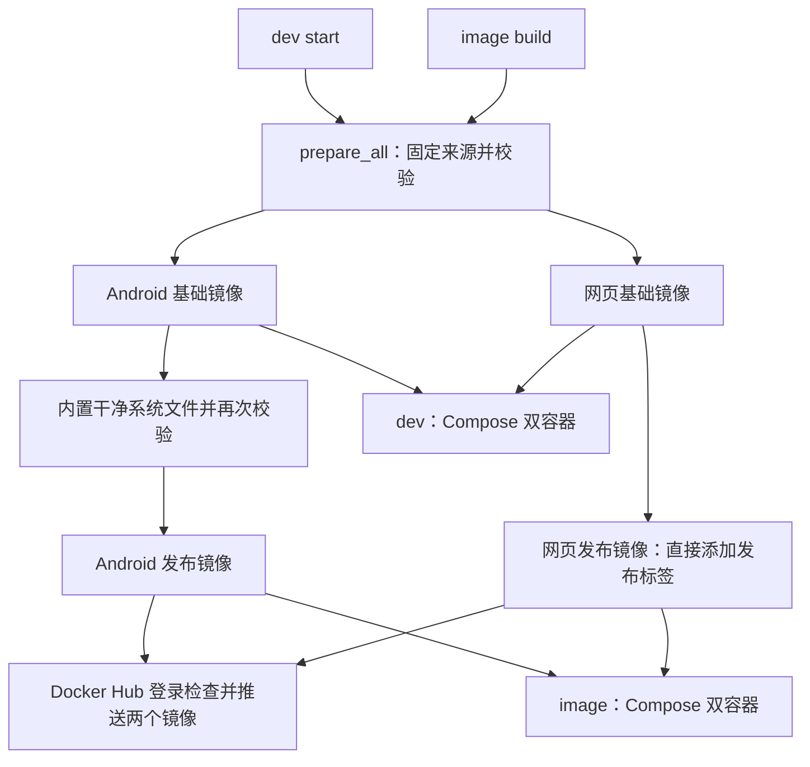
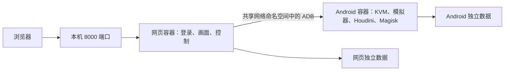

# 实现概览

**简体中文** | [English](OVERVIEW.en.md) | [使用说明](README.md)

`image` 和 `dev` 现在都采用 Android、网页两个容器。区别是镜像如何取得和数据如何挂载；没有合并服务的单容器构建或启动入口。

## 构建流程

`prepare_all` 检查工具和 KVM、校验系统文件及四个 SDK ZIP、生成 Dockerfile/Compose/补丁、构建两个基础镜像，并记录来源与已安装软件包版本。

`dev start` 随后运行开发 Compose。`image build` 通过 `Dockerfile.release` 给 Android 基础镜像加入干净的 system.img、ramdisk.img、Magisk APK；再给网页基础镜像添加发布标签。随后调用 `push_release_images`，通过 Docker 自身检查登录，复用有效凭据或引导登录，再依次推送两个标签。构建不启动手机，不复制用户状态。登录或任一推送失败时返回错误；已经成功的推送不会撤销。

Android 发布 Dockerfile 只以 Android 基础镜像为基础，不复制网页程序、不安装双服务监控入口。它继承与开发模式相同的 Android entrypoint。网页发布镜像与开发网页镜像是同一产物。

## 运行结构

`write_compose` 是两种模式共同的配置生成器。两者采用相同的模拟器参数、环境变量、健康检查、共享网络、重启策略和启动依赖。网页通过 `network_mode: service:android7` 共享 Android 网络命名空间，并等待 Android 健康检查成功。

开发模式追加 `build` 配置及 `patched/` 只读挂载，数据使用项目目录。镜像模式没有 `build` 配置，系统文件已内置，数据使用两个命名卷。只有宿主本地 8000 被发布，ADB 不额外开放端口。

## image 命令链

`image pull/start → cmd_image_start`：

1. 使用显式传入的两个镜像引用，或读取已保存的 `.android7-image.env`；首次使用默认两个标签，优先复用本地构建。
2. 检查 Docker、Compose 和 KVM，拒绝直接接管未迁移的旧单容器。
3. 本地缺少镜像时才拉取；检查 `cloudphone.component` 标签分别为 `android`、`web`，避免把旧合并镜像用错位置。
4. 保存两个引用并生成镜像模式 Compose。
5. 运行 `up -d --no-build --pull never`，确保部署阶段不意外构建或再次拉取。

`image stop/restart/down/log/status` 统一调用独立项目 `android7-image` 的 Compose。`purge` 先确认、停止并删除两个容器，再检查两个卷是否仍被其他容器引用，最后删除两个数据卷；不自动重启。

## 数据和迁移

| 模式 | Android 数据 | 网页数据 |
| --- | --- | --- |
| image | `yanyu-android7-data → /data` | `yanyu-ws-scrcpy-data → /data` |
| dev | `docker-state/ → /data` | `ws-scrcpy-data/ → /data` |

网页数据库现在位于网页容器的 `/data/wsscrcpy.db`。旧单容器使用 `/data/web/wsscrcpy.db`，因此迁移需要在停止旧容器后复制网页子目录，重新初始化程序依赖，同时保留数据库和账号。完整操作和回滚步骤见 README。

`down` 保留数据；`dev reset` 只重置 Android；`purge` 清除所选模式全部 Android 与网页运行状态。运行数据始终不进入发布镜像。

## 来源锁定与校验

| 输入 | 固定与校验 |
| --- | --- |
| Ubuntu、网页基础镜像 | 固定 OCI digest，由 Docker 校验 |
| Ubuntu 软件包 | 官方 `20260922T000000Z` 快照；仓库签名、索引与包哈希校验 |
| Command-line Tools | build 15859902 ZIP + SHA256 |
| Platform-Tools | 37.0.1 ZIP + SHA256，安装版本检查 |
| API 25 x86_64 | revision 1 ZIP + SHA256，安装版本检查 |
| Emulator | build 15917651 ZIP + SHA256、版本和动态库检查 |
| Houdini/Magisk | 固定 Git 提交的三个分卷，各自 SHA256；解压后分别校验系统、ramdisk、APK |
| 网页程序依赖 | 固定上游镜像内置 Node/scrcpy；ADB 来自已校验的 SDK ZIP |
| 发布镜像 | 仅按两个镜像标签部署；本地已有则复用，缺少才拉取，不固定产物摘要 |

复用缓存仍需检查真实内容。新下载使用唯一临时文件，验证成功才进入缓存。SDK 和发布系统文件在 Docker 构建内再次校验；错误内容会导致停止，不会自动改写期望哈希。

SDK 不再通过动态 SDK Manager 元数据选择版本。Ubuntu 历史快照只关闭过期检查，保留签名和包哈希验证；初始 HTTPS 根证书来自固定网页镜像的 Node 内置证书。

## 边界

- 宿主 Docker、Compose、curl、7z 等工具需预先安装，脚本不会自动更换宿主软件源。
- 新版双镜像需要分别发布。部署使用标签；旧配置中的 `标签@摘要` 会转换为标签，只有摘要而没有标签的旧配置需要手动指定两个标签。
- 网页依赖首次启动已预置；用户手动更新和已有数据卷中的自定义内容不属于干净构建的来源锁。
- 固定地址不能保证十年后服务仍在线；构建时间戳等也可能改变最终镜像 digest。保留已经发布的镜像仍然重要。
- 双容器使部署与开发结构一致，不自动解决软件渲染、ARM 转译或视频编码瓶颈。
